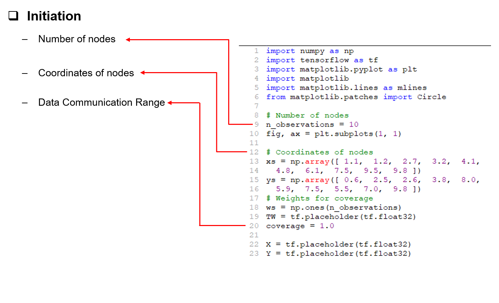
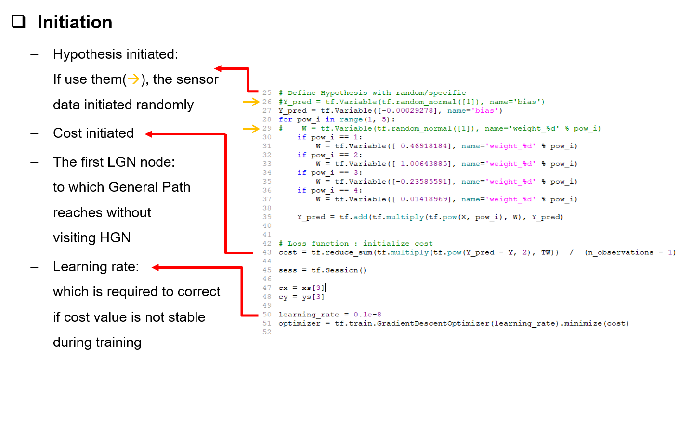
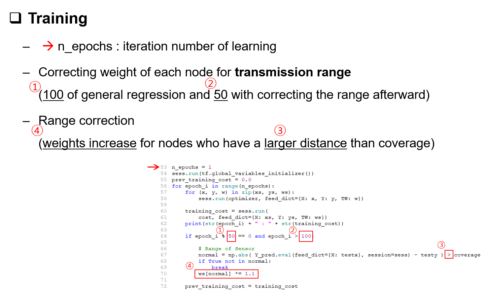
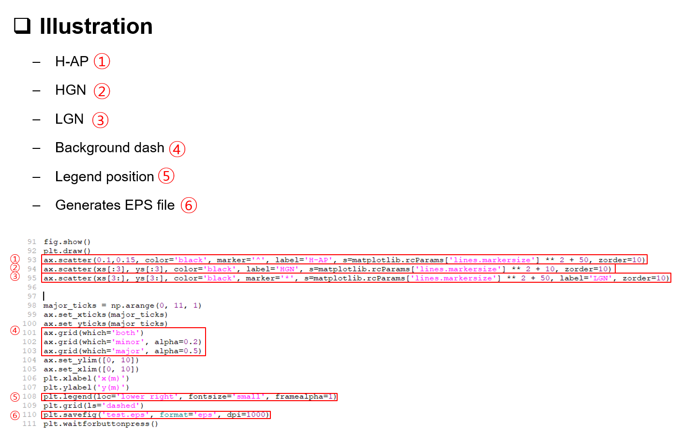

# UAVPathPlanning
#### A path planning for UAV collecting sensor data using polynomial regression  
  
### Description  
This program is an implementation of the follwing paper:  
> Weighted Harvest-Then-Transmit: UAV-Enabled Wireless Powered Communication Networks  
> [10.1109/ACCESS.2018.2882128](https://ieeexplore.ieee.org/document/8540379)  
  
The purpose is to generate a optimum path for collecting sensor data. 
The polynomial regression using GPS coordinates of deployed sensors generates an equation used in the path.  
In addition, this program corrects the path to communicate with all sensors to collect.  
  
### Prerequisite  
- Python (ver. 3.6)  
- Tensorflow for python 3.6  
- Matplotlib  

### Description  
* **Initiation**  
&nbsp;  

  
  

  
&nbsp;  

  
* **Training**  
&nbsp;  

  

  
&nbsp;  

  
* **Illustration**  
&nbsp;  

  
  

  
&nbsp;  

  
### Results  
